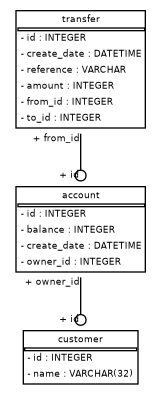

# Simple Bank API

## Overview

This is a basic HTTP API for a fictional bank. It is designed to be consumed by multiple frontends. This project was done to meet the requirements of a [codesubmit](https://codesubmit.io/) hiring test.

## Requirements

1. Python 3
2. Python-Pip
3. SQLite 3
4. Python package dependencies, install with `pip3 install -r requirements.txt`

## Usage

1. Clone repo.
2. Install Python package dependencies (above).
3. Open port `tcp/5000`
4. Initialise the databse with `python3 init_db.py`
5. Start the API server with `python3 run_server.py`

## API Specification

All methods respond with JSON formatted responses. The first key `status` will have values `fail`, `success`, or `error`. The second key `data` contains the payload. Status code `400` is returned if the required arguments are not supplied.

### List Customers

This returns a list of all customers on the company database. Only `GET` requests are supported. The endpoint URL is:

```
http://{HOSTNAME}/list_customers
```

A sample response is:

```json
{
  "data": {
    "customers": [
      {
        "id": 1, 
        "name": "Arisha Barron"
      }, 
      {
        "id": 2, 
        "name": "Branden Gibson"
      }, 
      {
        "id": 3, 
        "name": "Ronda Church"
      }, 
      {
        "id": 4, 
        "name": "Georgina Hazel"
      }
    ]
  }, 
  "status": "success"
}
```

The status code `200` is returned when customers are found and `204` if no customers are found.

### Create Account

This creates a new account, owned by the given customer. Only `POST` requests are supported. The endpoint URL is:

```
http://{HOSTNAME}/create_account?cust_id={cust_id}&init_dep={init_dep}
```

The query parameters are:

| Parameter  | Type    | Description                                                              |
| ---------- | ------- | ------------------------------------------------------------------------ |
| `cust_id`  | integer | The unique id of the customer who will own the account.                  |
| `init_dep` | integer | Initial deposit amount, in whole grains of salt. Must be more than zero. |

A sample response is:

```json
{
  "data": {
    "account_id": 2
  }, 
  "status": "success"
}
```

Status code `201` is returned on succesful creation. `403` is returned if the initial deposit amount is invalid and `406` if the customer id doesnt exist.

### List Accounts

This lists all active accounts for a given customer. Only `GET` requests are supported. The endpoint URL is:

```
http://{HOSTNAME}/list_accounts?cust_id={cust_id}
```

The query parameters are:

| Parameter | Type    | Description                    |
| --------- | ------- | ------------------------------ |
| `cust_id` | integer | The unique id of the customer. |

A sample response is:

```json
{
  "data": {
    "accounts": [
      {
        "balance": 1000, 
        "id": 1
      }, 
      {
        "balance": 450, 
        "id": 3
      }
    ]
  }, 
  "status": "success"
}
```

Status code `406` is returned if the customer id doesnt exist, and `404` is returned if there are no accounts associated with that customer id.

### Get Balance

This gets the current balance of a given account. Only `GET` requests are supported. The endpoint URL is:

```
http://{HOSTNAME}/get_balance?acc_id={acc_id}
```

The query parameters are:

| Parameter | Type    | Description                |
| --------- | ------- | -------------------------- |
| `acc_id`  | integer | The unique account number. |

A sample response is:

```json
{
  "data": {
    "balance": 1000
  }, 
  "status": "success"
}
```

Status code `406` is returned if the account id doesnt exist, and `200` is returned if the balance was succesfully retrieved.

### List Transactions

This lists all transactions linked to a given account. Only `GET` requests are supported. The endpoint URL is:

```
http://{HOSTNAME}/list_transactions?acc_id={acc_id}
```

The query parameters are:

| Parameter | Type    | Description                |
| --------- | ------- | -------------------------- |
| `acc_id`  | integer | The unique account number. |

A sample response is:

```json
{
  "data": {
    "transactions": [
      {
        "amount": 1000, 
        "date": "Sun, 23 Jan 2022 18:24:18 GMT", 
        "ref": "Initial Deposit"
      }, 
      {
        "amount": -90, 
        "date": "Sun, 23 Jan 2022 18:45:16 GMT", 
        "ref": "cat carriage"
      }, 
      {
        "amount": 120, 
        "date": "Sun, 23 Jan 2022 18:46:17 GMT", 
        "ref": "mouse house"
      }
    ]
  }, 
  "status": "success"
}
```

Status code `406` is returned if the account id doesnt exist, and `200` is returned if the transaction history was retrieved.

### Make Transfer

This creates a funds transfer from a source account to a destination account. Only `POST` requests are supported. The endpoint URL is:

```
http://{HOSTNAME}/transfer?from_acc={from_acc}&to_acc={to_acc}&ref={ref}&amount={amount}
```

The query parameters are:

| Parameter  | Type    | Description                                                            |
| ---------- | ------- | ---------------------------------------------------------------------- |
| `from_acc` | integer | Unique account id of the source account.                               |
| `to_acc`   | integer | Unique account id of the destination account.                          |
| `ref`      | string  | The reference, which will be shown in the transaction history.         |
| `amount`   | integer | The amount of funds to be transfered, in grains of salt. Non-negative. |

A sample response is:

```json
{
  "status": "success"
}
```

Status code `201` is returned if the transactions is succesfully registered. Code `403` is returned if there are insufficient funds in the source account, if an attempt is made to transfer from one account to the same account, or if the amount is negative. Code `404` is returned if either the destination or the source account do not exist.

## Testing

Run unit tests with `python3 test_api.py` while API server is running.

## Data Model

The backend database is designed to support an OLTP workload, mormalized to 3NF. The ERD is shown:



## Copyright and License

Copyright (c) 2022 Gary Jones

Permission is hereby granted, free of charge, to any person obtaining a copy of this software and associated documentation files (the "Software"), to deal in the Software without restriction, including without limitation the rights to use, copy, modify, merge, publish, distribute, sublicense, and/or sell copies of the Software, and to permit persons to whom the Software is furnished to do so, subject to the condition that the above copyright notice and this permission notice shall be included in all copies or substantial portions of the Software.

## References

1. [Flask-SqlAlchemy Documentation](https://flask-sqlalchemy.palletsprojects.com/)
2. [Flask Documentation](https://flask.palletsprojects.com/en/2.0.x/)
3. [Python unittest library Documentation](https://docs.python.org/3/library/unittest.html)
